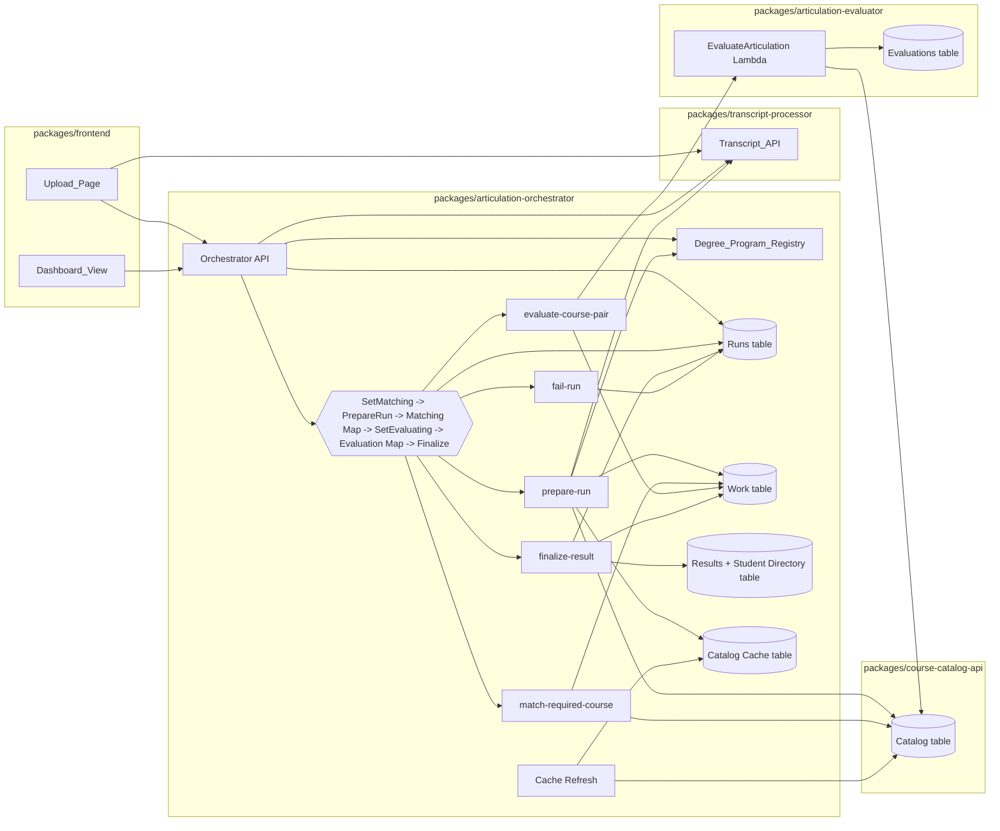

# Design Document

## Overview

`packages/articulation-orchestrator` coordinates completed transcript data, static Degree_Programs, Catalog records, and the existing single-pair Articulation_Evaluator. The revised architecture makes four boundaries explicit:

1. Transcript data is consumed through the real Transcript_API contract and normalized once.
2. Step Functions passes only bounded identifiers; all expanding candidate and result data is stored in a run-scoped DynamoDB work table.
3. Run creation and finalization are idempotent.
4. Results separate Required_Course matching outcomes from Pair evaluation outcomes and expose a dedicated student-directory access path.

The frontend builds on the sibling upload spec's typed `src/lib/api/` and `src/hooks/` conventions, but this design specifies the additional routes, DTOs, navigation, and result state required here.

## Architecture



## Workflow

### Idempotent creation

`POST /runs` accepts:

```typescript
interface CreateRunRequest {
  requestId: string; // UUID generated once per Upload_Page submission
  transcriptId: number;
  degreeProgramId: string;
}
```

The API validates the program, then calls Transcript_API status and detail routes. A usable transcript is completed and contains `student.id`. It conditionally writes a run with `runId = requestId`. If the run exists with identical input, it returns that run. Different input returns `409 REQUEST_ID_CONFLICT`.

The Step Functions execution name is `runId`. `ExecutionAlreadyExists` is success only when the existing run has identical input. A start failure updates the run to `failed/starting`, preventing an indefinitely pending record.

### State machine

The Standard workflow is:

1. **SetMatchingStatus** — conditional `pending -> matching` update.
2. **PrepareRun** — fetch transcript detail once, normalize it, resolve Required_Courses and usable Taken_Courses, fetch Catalog content, and persist work records.
3. **MatchingMap** — iterate only compact `{ runId, requiredCourseId }` references. Each task reads prepared candidates, calls matching AI, and writes requirement/pair-reference work records. Per-item catches write `errored`.
4. **SetEvaluatingStatus** — explicit transition even when no pair exists.
5. **ListPairRefs** — returns compact pair identifiers; if the count could exceed state payload bounds, process paginated work-table pages through a Distributed Map or nested executions. No full Catalog or result object enters state.
6. **EvaluatingMap** — iterate `{ runId, pairId }`, invoke evaluator, and persist each Pair_Result. Per-item catches write `failed`.
7. **FinalizeResult** — query work records, assemble one aggregate, and transact result/directory/run writes.
8. **FailRun** — top-level catches sanitize errors and write `failedStage` as `matching`, `evaluating`, or `persisting`.

Dedicated transition states ensure empty inputs still follow `pending -> matching -> evaluating -> completed`. Map workers never update run-level stage.

## Package layout

```text
packages/articulation-orchestrator/
  bin/articulation-orchestrator.ts
  lib/articulation-orchestrator-stack.ts
  lib/run-state-machine.ts
  src/
    config.ts
    aws/clients.ts
    domain/
      degree-program.ts
      degree-program-registry.data.ts
      transcript.ts
      catalog-resolution.ts
      work-record.ts
      course-result.ts
      orchestration-run.ts
      articulation-result.ts
      course-key.ts
    transcript/
      transcript-client.ts
      normalize-transcript.ts
    degree-programs/registry-service.ts
    catalog/
      catalog-cache-store.ts
      catalog-key-resolver.ts
      catalog-content-lookup.ts
    ai/
      institution-resolver.ts
      course-matcher.ts
    evaluator/evaluator-client.ts
    store/
      runs-store.ts
      work-store.ts
      results-store.ts
      catalog-cache-store.ts
    pipeline/
      prepare-run.ts
      match-required-course.ts
      evaluate-course-pair.ts
      finalize-result.ts
      fail-run.ts
    api/
      create-run.ts
      get-run-status.ts
      get-run-result.ts
      list-degree-programs.ts
      get-degree-program.ts
      list-students.ts
      list-student-results.ts
      get-latest-result.ts
      http.ts
      auth.ts
    jobs/refresh-catalog-cache.ts
```

## Transcript boundary

### Client

`transcript-client.ts` calls the existing HTTP endpoints and validates responses with Zod. It does not connect to Aurora. Required configuration includes the Transcript_API base URL and auth credentials appropriate to the deployment.

The detail contract reflects actual nullability:

```typescript
interface TranscriptStudentDto {
  id: number;
  student_id: string | null;
  full_name: string | null;
  institution: string | null;
  courses: TranscriptCourseDto[];
}

interface TranscriptCourseDto {
  id: number;
  course_code: string | null;
  course_name: string | null;
  department: string | null;
  term_year: string | number | null;
  year: string | number | null;
  credits: number | null;
}
```

### Normalization

```typescript
interface NormalizedStudent {
  studentKey: string;             // transcript-processor:<student.id>
  processorStudentId: number;
  externalStudentId?: string;
  displayName: string;
}

interface TakenCourse {
  sourceCourseId: number;
  courseCode?: string;
  courseTitle?: string;
  department?: string;
  credits?: number;
  rawInstitution?: string;
  rawAcademicYear?: string;
}
```

Institution is inherited from `student.institution`. Academic year uses the first value matching `YYYY` or `YYYY-YYYY` from `term_year`, then `year`. Missing identifier fields create one `EXCLUDED_TAKEN` work record rather than failing the run.

The create API verifies completion and student identity. `PrepareRun` fetches detail again as the authoritative snapshot used by processing; this avoids storing large transcript data in the API-to-state-machine input while still validating before run creation.

## Degree Program registry

Course code is mandatory because both Catalog and evaluator lookups are keyed by code. Title remains optional semantic/display metadata.

```typescript
const RequiredCourseSchema = z.object({
  institution: z.string().trim().min(1).max(200),
  academicYear: z.string().regex(/^\d{4}(-\d{4})?$/),
  courseCode: z.string().trim().min(1).max(20),
  courseTitle: z.string().trim().min(1).max(200).optional(),
});
```

Duplicate detection uses normalized institution, academic year, and normalized course code rather than raw JSON serialization. Registry validation runs at module load and in tests/build validation.

## Catalog resolution

### Resolution model

```typescript
type ResolutionMethod =
  | 'exact'
  | 'exact-institution-year-fallback'
  | 'ai-institution'
  | 'ai-institution-year-fallback';

type CatalogResolution =
  | {
      kind: 'resolved';
      original: { institution: string; academicYear: string };
      resolved: { institution: string; academicYear: string };
      method: ResolutionMethod;
    }
  | {
      kind: 'unresolved';
      original: { institution?: string; academicYear?: string };
      reasonCode: string;
      message: string;
    };
```

Required and taken sides each carry their own `CatalogResolution`.

### Algorithm

1. Test exact `catalogId(raw institution, raw year)` metadata.
2. Load the normalized institution directory from cache.
3. If the normalized raw institution exactly identifies a known institution, select it without AI.
4. Otherwise ask Bedrock to select one known institution or `none` using forced structured output.
5. If requested year exists for the resolved institution, use it.
6. Otherwise choose the year with the greatest chronological end year.
7. Fetch course content by normalized course code. Missing content produces unresolved.

This ordering avoids asking AI to rediscover an exact institution when only the year is absent.

### Catalog cache

The cache uses bounded records rather than one item:

```text
PK=CACHE#CATALOG_DIRECTORY, SK=INSTITUTION#<normalized-name>
{ institution, normalizedInstitution, academicYears[], snapshotId, updatedAt }
```

A metadata item records the active snapshot. Refresh writes a new snapshot and atomically switches metadata after all institution records succeed. A missing active snapshot triggers one controlled refresh guarded by a lock; if refresh fails, preparation fails rather than falsely marking every course unresolved. The scheduled refresh remains every 15 minutes.

## Work-table design and payload bounds

`Orchestration_Work` uses `PK=RUN#<runId>` and typed sort keys:

```text
STUDENT
EXCLUDED_TAKEN#<sourceCourseId>
CANDIDATE#<sourceCourseId>
REQUIRED#<requiredCourseId>
PAIR#<pairId>
PAIR_RESULT#<pairId>
```

Catalog content and outcomes live in these records. Map input contains IDs only, and task output is discarded (`ResultPath: DISCARD`) after persistence. This prevents the 500-course registry limit and full Catalog content from accumulating in Step Functions state.

`PrepareRun` performs all Taken_Course resolution and content fetches once. Match workers reuse those records, eliminating repeated N×M key resolution and duplicate unresolved entries.

## Matching

Each resolvable Required_Course is loaded with full Catalog content and matched against prepared candidates. One Bedrock Converse request per requirement is preferred. If estimated input exceeds the configured model budget, deterministic candidate chunks are permitted; every candidate must still receive exactly one final determination before pair creation.

Tool output is validated for:

- exactly one determination per supplied candidate;
- no unknown or duplicate candidate IDs;
- explicit boolean match decision.

No matches writes `matchingOutcome: unmatched`. Resolution failure writes `unresolved`. AI/validation failure writes `errored`. Matches write a `matched` requirement record and deterministic pair IDs derived from required and taken IDs.

## Evaluator boundary

The evaluator remains a direct Lambda invoke because its package is deployable rather than a shared library. The client validates both request and response and handles `FunctionError`, missing payload, malformed JSON, and unexpected result variants.

```typescript
async function evaluatePair(pair: WorkPair): Promise<PairResult> {
  const result = await evaluateArticulation(pair.requiredIdentifier, pair.takenIdentifier);
  if (result.kind === 'EVALUATED') {
    return {
      pairId: pair.pairId,
      outcome: 'evaluated',
      decision: result.evaluation.assessment.decision,
      confidence: result.evaluation.assessment.confidence,
      rationale: result.evaluation.assessment.rationale,
    };
  }
  return { pairId: pair.pairId, outcome: 'unresolved', message: publicMessage(result) };
}
```

Thrown errors become a sanitized `failed` Pair_Result. Each work write is idempotent by pair sort key.

## Result model

```typescript
interface RequiredCourseResult {
  requiredCourseId: string;
  requiredCourse: RequiredCourse;
  requiredResolution: CatalogResolution;
  matchingOutcome: 'matched' | 'unmatched' | 'unresolved' | 'errored';
  message?: string;
  pairResults: PairResult[];
}

interface PairResult {
  pairId: string;
  takenCourse: TakenCourse;
  takenResolution: CatalogResolution;
  outcome: 'evaluated' | 'unresolved' | 'failed';
  decision?: 'EQUIVALENT' | 'PARTIAL' | 'NOT_EQUIVALENT';
  confidence?: 'HIGH' | 'MEDIUM' | 'LOW';
  rationale?: string;
  message?: string;
}

interface ArticulationResult {
  resultId: string; // runId
  runId: string;
  transcriptId: number;
  student: NormalizedStudent;
  degreeProgramId: string;
  createdAt: string;
  excludedTakenCourses: ExcludedTakenCourse[];
  requiredCourseResults: RequiredCourseResult[];
}
```

This removes the prior ambiguity where unmatched requirements and evaluated pairs shared one flat outcome union.

## Persistence and access patterns

### Runs table

`PK=runId`. The request ID is the run ID, enabling a strongly consistent conditional idempotency check. The record includes `resultKey` and `resultSortKey` after completion. Status updates use conditions enforcing legal monotonic transitions.

### Results table

Result records:

```text
PK=RESULT#<transcriptId>#<degreeProgramId>
SK=<createdAt>#<resultId>
```

`resultId = runId`, and `createdAt` is generated once and stored on the run before final assembly. Retries therefore address the same item. A `byStudent` GSI uses `studentKey` and `<createdAt>#<resultId>`.

Student directory records share the table:

```text
PK=STUDENT_DIRECTORY
SK=<studentKey>
{ displayName, externalStudentId?, latestResultAt, latestResultId, resultCount }
```

`GET /students` queries the constant directory partition with pagination; it does not scan result items. At expected scale this partition is acceptable. If write/read volume approaches a hot-partition threshold, deterministic directory shards and cursor fan-in are the planned evolution.

`FinalizeResult` uses `TransactWriteItems` to:

1. conditionally put the deterministic result;
2. update the student summary only when the incoming result is newer;
3. conditionally update the run from `evaluating` to `completed` with its locator.

On ambiguous failure, it reads the run and deterministic result. Existing matching state is success; inconsistent state is retried or failed with `persisting`.

### Result APIs

```text
GET /students?cursor=&limit=
GET /students/{studentKey}/results?cursor=&limit=
GET /results/{transcriptId}/{degreeProgramId}       # latest
GET /runs/{runId}/result                            # exact completed-run result
```

All cursors are opaque encoded DynamoDB continuation keys.

## HTTP API and errors

Additional routes:

```text
POST /runs
GET  /runs/{runId}
GET  /runs/{runId}/result
GET  /degree-programs
GET  /degree-programs/{id}
GET  /students
GET  /students/{studentKey}/results
GET  /results/{transcriptId}/{degreeProgramId}
```

Errors use `{ code, message, correlationId? }`. Public messages never include stack traces, prompts, model output, downstream payloads, AWS names/ARNs, or database details. Full errors are logged with correlation IDs.

Every non-local route is protected in the API Lambda by one generated shared key stored in Secrets Manager. CDK grants secret read access only to `ApiHandler`, passes only the secret ARN in its environment, and never outputs the secret value. `ApiHandler` reads and caches the key briefly, compares the `x-api-key` header with a timing-safe comparison, and returns generic `UNAUTHORIZED` on a missing or invalid key. Local stacks explicitly bypass this check. This is a non-production prototype boundary: a browser must receive the shared key at build/runtime and can therefore expose it; production requires user authentication and authorization.

## Frontend design

```text
src/lib/api/
  orchestratorTypes.ts
  orchestratorApi.ts
src/hooks/
  useDegreePrograms.ts
  useCreateOrchestrationRun.ts
  useOrchestrationRunPolling.ts
  useStudentDirectory.ts
  useStudentResults.ts
  useRunResult.ts
src/pages/
  ArticulationUploadPage.tsx
components/Dashboard.tsx
```

`App.tsx` provides distinct Dashboard and Upload_Page navigation using the project's routing convention; if no router exists at implementation time, a minimal route dependency or existing screen-state convention is selected explicitly in that task.

The Upload_Page reuses transcript upload/status hooks. It creates a UUID once when a valid submission begins and retains it across API retries and React rerenders. Polling stops on terminal status, unmount, or ten minutes. Completed navigation includes `runId`, and Dashboard calls `/runs/{runId}/result` for exact selection.

Dashboard loads `/students`, then selected-student results. It defaults to the newest result unless a run locator is present. Any active request failure clears dependent stale state. Mock imports are removed from the articulation-result rendering path.

## Correctness properties

1. Registry validation accepts exactly programs with mandatory valid course codes and normalized uniqueness.
2. Transcript normalization uses student institution and `term_year`-before-`year`, and excludes each malformed course exactly once.
3. Repeated identical Request_Id creation returns one run/execution; conflicting input returns conflict.
4. Stage transitions are monotonic and occur even for empty collections.
5. Preparation resolves and fetches each Taken_Course at most once per run.
6. Exact institution matching never invokes AI; AI is used only after exact institution failure.
7. Year fallback selects the latest chronological end year.
8. Required and taken resolution provenance never overwrite each other.
9. Match output creates exactly the AI-marked pairs and rejects malformed determinations.
10. One requirement's matching error and one pair's evaluator error never stop siblings.
11. Step Functions state contains identifiers rather than Catalog content or aggregate results.
12. Every Required_Course appears exactly once; only matched requirements contain Pair_Results.
13. Evaluator variants map deterministically to evaluated, unresolved, or failed.
14. Repeated finalization converges on one deterministic result and one completed run.
15. Distinct runs append distinct result records even with equal timestamps.
16. Student-directory listing returns one summary per student without scanning result records.
17. Exact run-result navigation retrieves the result produced by that run.
18. Frontend polling starts a run once, stops correctly, and clears stale data on errors.
19. Public errors contain only stable codes, sanitized messages, and optional correlation IDs.

## Testing strategy

- Unit/property tests cover normalization, registry validation, resolution ordering, year sorting, matching validation, outcome mapping, legal status transitions, and idempotent finalization.
- Store tests use mocked DynamoDB commands to verify keys, conditional expressions, transactions, pagination, and retry convergence.
- Workflow tests synthesize the CDK template and assert explicit transition states, discarded Map outputs, catches, concurrency, IAM, authorizer wiring, and all four tables.
- Contract tests validate Transcript_API DTOs and evaluator payload/result parsing against fixtures derived from current handlers.
- Frontend tests cover validation, Request_Id reuse, upload/run polling, timeout, exact-result navigation, student pagination, outcome rendering, empty/error states, and absence of mock imports.
- An integration smoke test uses mocked Transcript_API, Catalog, Bedrock, and evaluator boundaries to execute empty, mixed-success, retry, and finalization-recovery runs.
